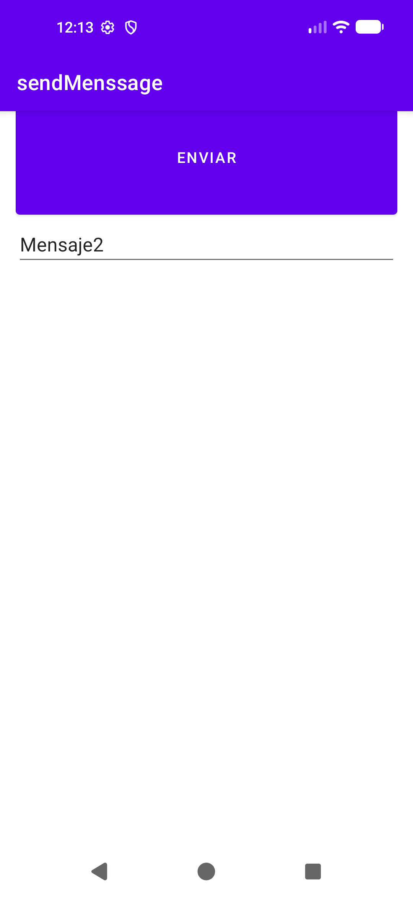
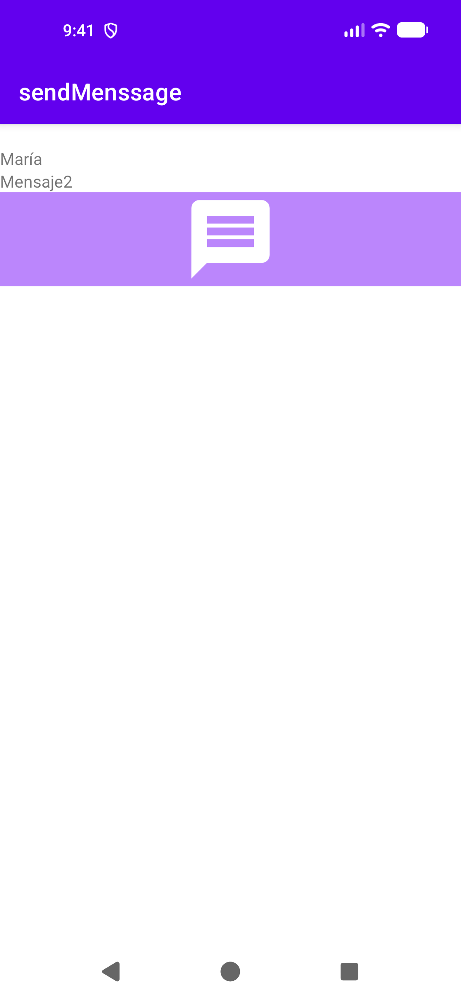
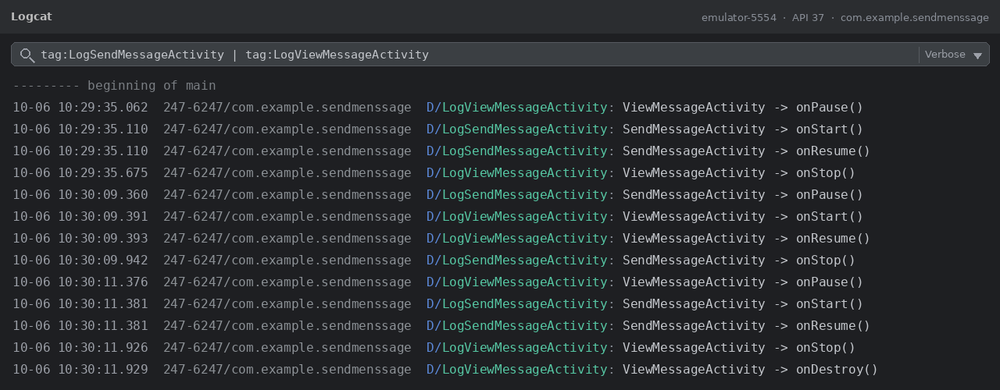
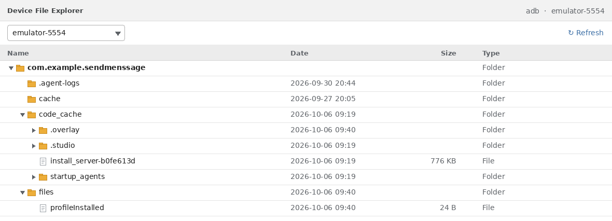

# 📱 SendMessage — App Android en Kotlin con Activities, Intent y Bundle para pasar datos entre pantallas


Aplicación nativa para **Android** desarrollada en **Kotlin** que ilustra la arquitectura básica de navegación y paso de datos entre *Activities* utilizando `Intent` y `Bundle` (objetos `Parcelable`), además de buenas prácticas de diseño en **Android Studio**: layouts XML con Material Design, fuentes tipográficas personalizadas, accesibilidad e internacionalización, depuración con **Logcat** y exploración del sistema de archivos privado de la aplicación (`/data/data/`).

| Aspecto | Detalle |
|---|---|
| 🧩 Módulo Gradle | `:app` (applicationId `com.example.sendmenssage`) |
| 💻 Lenguaje | Kotlin 2.4.20 |
| 📦 Versión | 1.0.0 (`versionName = "1.0"`, `versionCode = 1`) |
| 🤖 SDK | `minSdk 24` · `targetSdk/compileSdk 37` |
| 🛠️ Build | Android Gradle Plugin 9.3.3 · Gradle 9.5.0 (Kotlin DSL) · Java 11 |
| 📄 Documentación | KDoc generada con Dokka 2.2.0 y publicada en GitHub Pages |

---

## 📸 Capturas de Pantalla en el Emulador

|             Pantalla Principal (`SendMessageActivity`)             |            Pantalla de Visualización (`ViewMessageActivity`)            |
|:------------------------------------------------------------------:|:-----------------------------------------------------------------------:|
|  |  |
|          *Ingreso del texto del mensaje y botón de envío*          |              *Recepción y despliegue del mensaje enviado*               |

> 💡 **Flujo de Usuario**: El usuario escribe un texto en el campo `EditText` de la actividad principal. Al presionar el botón **Enviar** (`FloatingActionButton`), se crea un `Intent` explícito con un `Bundle` que contiene el objeto `Message` (emisor, receptor y contenido) y navega a la segunda actividad para mostrarlo.

---

## ✨ Características

- **Dos activities con navegación explícita**: `SendMessageActivity` (launcher) captura el texto del usuario y `ViewMessageActivity` lo muestra.
- **Paso de datos con `Intent` + `Bundle`**: el mensaje se envía bajo la clave `KEY_MESSAGE`.
- **Modelo parcelable**: las clases `Message` y `Person` usan `@Parcelize` (plugin `kotlin-parcelize`) para serializarse entre procesos de forma eficiente frente a `Serializable`.
- **Ciclo de vida instrumentado**: todas las actividades registran `onCreate`, `onStart`, `onResume`, `onPause`, `onStop` y `onDestroy` en Logcat con un TAG propio por clase.
- **Diseño XML responsivo**: `LinearLayout` vertical con unidades correctas (`sp` para fuentes, `dp` para espaciados).
- **Tipografía personalizada**: fuentes en `res/font/` (`emily_street.ttf` aplicada con `android:fontFamily` y `original_surfer_regular.ttf` disponible como recurso).
- **Accesibilidad e internacionalización**: cadenas extraídas a `res/values/strings.xml`, `android:hint`, `android:contentDescription` y soporte de temas *night* y orientaciones (`values-night/`, `values-land/`).
- **Teclado adaptativo**: `android:windowSoftInputMode="adjustResize"` en ambas actividades.
- **Documentación automática**: KDoc + Dokka publicada automáticamente en GitHub Pages mediante GitHub Actions.

---

## 🏗️ Arquitectura y Stack Tecnológico

### 🧭 Modelo de Arquitectura

El proyecto sigue una **arquitectura basada en Activities e Intents** (patrón de navegación nativo sin frameworks):

1. **Capa de presentación**: activities con layouts XML inflados mediante `setContentView` + `findViewById` (con View Binding habilitado en el módulo para uso opcional).
2. **Capa de modelo**: paquete `model/` con `data class` inmutables (`Message`, `Person`) anotadas con `@Parcelize`.
3. **Navegación**: `Intent` explícito entre activities y transferencia de estado mediante `Bundle`.
4. **Punto de entrada**: clase `SendMessageApplication` declarada en el `AndroidManifest.xml`.

> 📌 El módulo tiene habilitados View Binding y Jetpack Compose (BOM `2026.02.01`), junto con dependencias de Navigation y Lifecycle; la UI implementada actualmente se resuelve íntegramente con **layouts XML + Material Components**.

### 🛠️ Stack Tecnológico

| Tecnología | Versión | Propósito |
|---|---|---|
| [Kotlin](https://kotlinlang.org/) | 2.4.20 | Lenguaje principal de la aplicación |
| Android Gradle Plugin / Gradle | 9.3.3 / 9.5.0 | Sistema de compilación (Kotlin DSL) |
| `androidx.appcompat` | 1.8.0 | Compatibilidad con versiones antiguas de Android |
| Material Components | 1.10.0 | Componentes UI (`FloatingActionButton`, temas) |
| `androidx.constraintlayout` | 2.1.4 | Layouts flexibles |
| `androidx.core-ktx` | 1.19.1 | Extensiones Kotlin para AndroidX |
| `androidx.lifecycle-runtime-ktx` | 2.11.0 | Ciclo de vida con Kotlin |
| Plugin `kotlin-parcelize` | 2.4.20 | Serialización `Parcelable` de data classes |
| Dokka | 2.2.0 | Generación de documentación KDoc (HTML) |
| JUnit / Espresso / AndroidX Test | 4.13.2 / 3.7.0 / 1.3.0 | Pruebas unitarias y de instrumentación |
| `androidx.activity-ktx` | 1.13.0 | Extensiones Kotlin para `Activity` |
| `androidx.navigation` (fragment/ui) | 2.6.0 | Navegación declarativa (incluida, no usada por la UI actual) |
| Jetpack Compose BOM | 2026.02.01 | Versionado centralizado de Compose (habilitado; la UI actual usa XML) |
| `androidx.compose.material3` | (BOM) | Componentes Material 3 disponibles |

---

## 🚀 Puesta en Marcha (Getting Started)

### ✅ Requisitos Previos

- **Android Studio** (última versión estable, compatible con AGP 9.3.3).
- **JDK 11 o superior** (el proyecto configura `sourceCompatibility`/`targetCompatibility` en Java 11; Gradle resuelve el toolchain automáticamente mediante *foojay-resolver*).
- **Dispositivo o emulador con Android 7.0 (API 24) o superior**.
  > ⚠️ Se recomienda **API 33 (Android 13) o superior**: `ViewMessageActivity` utiliza la sobrecarga `Bundle.getParcelable(key, Class)` introducida en Android 13.

### 📥 Instalación y Ejecución

1. Clonar el repositorio:

   ```bash
   git clone https://github.com/Jarcg/SendMessage.git
   cd SendMessage
   ```

2. Abrir el proyecto en **Android Studio** (`File > Open...`).
3. Sincronizar Gradle cuando aparezca el aviso (*Sync Now*).
4. Seleccionar un dispositivo/emulador y pulsar **▶ Run 'app'**.

Compilación alternativa por línea de comandos (genera la APK de depuración en `app/build/outputs/apk/debug/`):

```bash
./gradlew assembleDebug
```

### 📚 Generar la Documentación (Dokka)

```bash
./gradlew dokkaGenerate
```

La salida HTML se genera en la carpeta `documentation/html/`.

La documentación HTML se publica automáticamente en **GitHub Pages** en cada *push* a `main` mediante el workflow `.github/workflows/desplegar-dokka.yml`.

---

## 🧩 Módulos, Componentes y Contratos (API de la App)

> ℹ️ La aplicación es **100 % offline**: no consume ninguna API REST ni servicios web externos. Esta sección describe la "interfaz pública" interna: componentes de entrada y contratos de datos entre pantallas.

### 📦 Componentes de entrada

| Componente | Tipo | Rol |
|---|---|---|
| `SendMessageActivity` | Activity (`LAUNCHER`) | Captura el texto del usuario y lanza el `Intent` de navegación |
| `ViewMessageActivity` | Activity | Recibe el `Bundle` y muestra el mensaje recibido |
| `SendMessageApplication` | clase `Application` | Inicialización global declarada en `AndroidManifest.xml` |

### 🔑 Contrato de datos entre Activities

| Clave | Tipo | Descripción |
|---|---|---|
| `KEY_MESSAGE` | `Message` (`Parcelable`) | Objeto serializado con `@Parcelize` que contiene emisor, receptor y contenido |

### 🧪 Modelos de datos

| Modelo | Propiedades | Serialización |
|---|---|---|
| `Message` | `id: Int`, `content: String`, `sender: Person`, `receiver: Person` | `@Parcelize` → `Parcelable` |
| `Person` | `dni: String`, `name: String`, `surname: String` | `@Parcelize` → `Parcelable` |

> 📌 No existen endpoints HTTP: la única "API" pública de la aplicación es el contrato `KEY_MESSAGE` descrito arriba.

---

## 📂 Estructura del Proyecto

```text
sendMenssage/
├── app/
│   ├── src/
│   │   ├── main/
│   │   │   ├── java/com/example/sendmessage/
│   │   │   │   ├── SendMessageActivity.kt       # Actividad de origen: captura entrada e inicia el Intent
│   │   │   │   ├── ViewMessageActivity.kt       # Actividad de destino: recupera datos del Intent y muestra UI
│   │   │   │   ├── SendMessageApplication.kt    # Clase Application personalizada
│   │   │   │   └── model/
│   │   │   │       ├── Message.kt               # Modelo parcelable del mensaje (id, contenido, emisor, receptor)
│   │   │   │       └── Person.kt                # Modelo parcelable de persona (dni, nombre, apellidos)
│   │   │   ├── res/
│   │   │   │   ├── font/                        # Fuentes tipográficas personalizadas (Emily Street, Original Surfer)
│   │   │   │   ├── layout/                      # Diseños XML (activity_send_message.xml, activity_view_message.xml)
│   │   │   │   ├── values/                      # Reutilización de strings.xml, colors.xml, dimens.xml
│   │   │   │   ├── values-night/, values-land/, values-w*/   # Variantes de tema nocturno, orientación y ancho
│   │   │   │   ├── drawable/                    # Recursos gráficos e íconos vectoriales
│   │   │   │   └── navigation/, xml/            # Gráficos de navegación y reglas de backup
│   │   │   └── AndroidManifest.xml              # Declaración de componentes e Intents de la app
│   └── build.gradle.kts                         # Configuración de compilación del módulo
├── docs/
│   └── screenshots/                             # Capturas de pantalla e imágenes para documentación
├── documentation/html/                          # HTML generado por Dokka (publicado en GitHub Pages)
├── .github/workflows/desplegar-dokka.yml        # CI: generación y despliegue de documentación
├── gradle/libs.versions.toml                    # Catálogo de versiones de dependencias
├── settings.gradle.kts                          # Configuración multi-módulo y repositorios
├── gradle.properties                            # Propiedades de la JVM y del sistema Gradle
├── resource/                                    # Recursos auxiliares (SVG e imágenes de marca)
├── CHANGELOG.md                                 # Registro de cambios y versiones
└── README.md                                    # Documentación principal
```

> 📝 **Identificador**: el `namespace`/paquete de código fuente es `com.example.sendmessage`, mientras que el `applicationId` publicado es `com.example.sendmenssage`.

---

## 🎨 Decisiones de Diseño e Interfaz

1. **Arquitectura basada en Actividades e Intents**:
   - Se eligió una navegación mediante `Intent` explícito (`Intent(this, ViewMessageActivity::class.java)`) para demostrar el desacoplamiento de pantallas y la transferencia de datos mediante clave-valor (`KEY_MESSAGE`).

2. **Diseño de Interfaz Responsivo (`LinearLayout` & Unidades)**:
   - Uso de `LinearLayout` vertical para estructurar los elementos ordenadamente de arriba a abajo.
   - **Dimensiones Adaptables**: Utilización estricta de `sp` para tamaños de fuentes (`tvTitle`, `iVMessageSize`) y `dp` para márgenes/espaciados, garantizando la correcta escalabilidad según las preferencias de accesibilidad del usuario.

3. **Tipografía y Estilo Visual**:
   - Integración de fuentes tipográficas personalizadas instaladas en `res/font/`: `emily_street.ttf` asociada mediante la propiedad `android:fontFamily` y `original_surfer_regular.ttf` incluida como recurso tipográfico disponible.

4. **Accesibilidad e Internacionalización**:
   - Extracción de todas las cadenas de texto al archivo `res/values/strings.xml`.
   - Uso de atributos de accesibilidad como `android:hint` en campos de texto y `android:contentDescription` en componentes de imagen (`ImageView`).

5. **`Parcelable` frente a `Serializable`**:
   - Los modelos se serializan con `@Parcelize` en lugar de `Serializable` para evitar el copiado *bit a bit* completo y reducir el costo de transmisión entre procesos.

---

## 🐛 Proceso de Depuración y Evidencias de Logcat

### 🔍 Flujo de Depuración en Android Studio

1. **Puntos de Interrupción (Breakpoints)**:
   - Se colocan *breakpoints* en el evento `setOnClickListener` de `SendMessageActivity.kt` para inspeccionar el valor capturado de `etMessageText.text.toString()`.
   - Evaluación en tiempo de ejecución del contenido del objeto `Bundle` antes de invocar `startActivity(intent)`.

2. **Seguimiento mediante Logcat**:
   - Filtrado en la ventana de **Logcat** de Android Studio mediante el paquete `package:mine` o `package:com.example.sendmenssage`, o por los TAGs `LogSendMessageActivity` y `LogViewMessageActivity`.
   - Verificación de los ciclos de vida de las actividades (`onCreate`, `onStart`, `onResume`, `onPause`, `onStop`, `onDestroy`) y mensajes de depuración personalizados.

### 🖼️ Evidencia en Logcat


---

## 📁 Acceso al Directorio `/data/data/` de la Aplicación

El directorio privado de la aplicación se encuentra en la memoria interna del sistema Android en la ruta:
```text
/data/data/com.example.sendmenssage/
```

### 🛠️ Exploración mediante Device File Explorer
A través de la herramienta **Device File Explorer** integrada en Android Studio o mediante ADB Shell (`adb shell` -> `run-as com.example.sendmenssage`), se puede acceder al almacenamiento interno privado de la app donde se gestionan:
- **`cache/`**: Archivos temporales.
- **`code_cache/`**: Archivos de caché compilados.
- **`files/`**: Archivos internos generados por la aplicación.
- **`shared_prefs/`** y **`databases/`**: Preferencias XML y bases de datos SQLite/Room (aparecen automáticamente cuando la app utiliza estas funcionalidades).

### 🖼️ Imagen del Explorador de Archivos en `/data/data/`


---

## 📚 Enlaces a la Documentación Oficial de Android Developer

Para mayor información sobre los componentes y conceptos utilizados en esta aplicación, consulta la documentación oficial de Android:

- 🔗 [Intents e Intent Filters](https://developer.android.com/guide/components/intents-filters)
- 🔗 [Ciclo de Vida de las Actividades (Activities)](https://developer.android.com/guide/components/activities/activity-lifecycle)
- 🔗 [Guía de Layouts y Vistas en XML](https://developer.android.com/guide/topics/ui/declaring-layout)
- 🔗 [Depuración y Registro con Logcat en Android Studio](https://developer.android.com/studio/debug/am-logcat)
- 🔗 [Explorador de Archivos del Dispositivo (Device File Explorer)](https://developer.android.com/studio/debug/device-file-explorer)
- 🔗 [Uso de Recursos Tipográficos en Android](https://developer.android.com/guide/topics/ui/look-and-feel/fonts-in-xml)
- 🔗 [Pasando datos entre Activities con Parcelable](https://developer.android.com/guide/components/activities/parcelables-and-bundles)

---

## 📄 Licencia y Contacto

Proyecto desarrollado con fines **educativos y de demostración técnica** de desarrollo Android nativo con Kotlin. No se distribuye bajo una licencia abierta formal; ponte en contacto con el autor si deseas reutilizar el código.

- ✍️ **Autor**: Jacinto Rafael Cortés
- 💬 **Contacto**: GitHub [@Jarcg](https://github.com/Jarcg)
- 📦 **Repositorio**: [github.com/Jarcg/SendMessage](https://github.com/Jarcg/SendMessage)
- 📜 **Historial de versiones**: [`CHANGELOG.md`](CHANGELOG.md)
